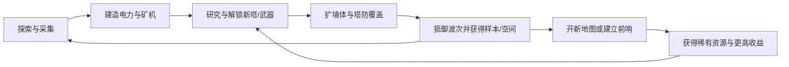

# 《The Riftbreaker》复刻向产品设计文档

## 执行摘要

《The Riftbreaker》本质上不是单一“塔防”或“ARPG”，而是一个把**角色直接参战、基地经济、跨地图资源运输、环境生存**压在同一条压力曲线上的复合型系统游戏：玩家一边亲自打穿前线，一边搭建自动化生产和防御网络，再用多地图前哨把中后期经济做大。官方站点与 Steam 的定位都把它描述为“基地建设 + 生存 + Action-RPG + 探索”，而官方 Wiki 则进一步显示，这个混合品类之所以成立，关键在于其**持续升级的攻击波、资源分层、研究解锁、Biome 规则差异**彼此咬合。citeturn22view0turn22view1turn25search6turn21view2

如果你的目标是“模仿它”，最应该复刻的不是美术或具体怪物，而是它的**压力传导结构**：敌潮逼防线，防线逼经济，经济逼扩图，扩图逼研究与抗环境，再反过来改写战斗和塔防手感。官方站点强调“攻击会随着时间越来越强”“敌群会达到成千上万”，而 Survival 页面则给出了**首波时间、波次间隔、HQ 升级触发特别波、地图边缘更高强度**等明确锚点，这些足以反推出一个可执行的克隆框架。citeturn22view0turn22view1turn31view0

因此，本文不追求“1:1 还原全内容”，而是把公开资料中最重要的玩法、数值、地图与解锁规律，整理成一份**MVP 可落地、后续可扩展**的中文产品文档。凡是表格中的“原作锚点”，都来自官方站点、Steam、官方 Wiki 与权威社区；凡是“建议复刻值/公式”，都明确标注为基于这些锚点的推导方案。citeturn22view0turn22view1turn25search6turn24search4turn13search4

## 研究范围与复刻原则

本报告按你指定的范围，默认聚焦 **PC/Steam、单人 Campaign/Survival**，不把合作模式、DLC 专属内容当作最小实现前提。这样做是因为基础产品骨架在官方站点、Steam 页面与基础 Campaign/Survival 资料里已经完整成立：主线要求在 Galatea 37 建立返回地球的双向裂隙传送能力，Campaign 通过多地图长期经营推进，Survival 则用固定时长与不断增强的波次提供高压测试。citeturn22view0turn22view1turn21view2turn31view0

复刻时建议坚持四条原则。第一，**玩家角色必须是防线的一部分，而不是旁观建筑师**，因为 Mr. Riggs 有 6 个武器槽、主动技能、召唤技能与近战/远程双持能力，官方站点也明确把“Hack and Slash”列为核心卖点。第二，**塔防不是独立子游戏，而是经济与后勤的最终出口**；塔会消耗电力、塔弹药、液体或特殊资源，Ammo Factory 与 Ammunition Storage 直接把防御表现绑定到经济。第三，**地图差异必须改变建造逻辑，而不是只改贴图**，例如沙漠的流沙地基、酸地的酸雷、火山的冷却建造区、以及不同的太阳/风/地热倍率。第四，**研究必须同时是节奏器与目标树**，因为 Download/Analysis 产出速度、HQ/Armory/Laboratory 等级、Biomes 的 Familiarity 与任务线都会影响可研究内容。citeturn17view0turn17view1turn22view0turn10view2turn30view0turn33view0turn33view1turn35view0turn35view1turn25search6turn26view0turn26view1

一个最重要的复刻判断是：**不要先做“超多塔”或“超多敌人”，先做可闭环的压力系统**。EXOR 官方站点把《The Riftbreaker》的核心写得很直白：建设复杂基地、在不同生物群落建立前哨、攻击会随时间增强、需要研究应对方案。把这些串起来，才是这个产品的识别度。citeturn22view0turn22view1

下面这张图给出建议的复刻循环骨架。



上图所表达的逻辑，与官方 About/Features 对“采样—研究—建造—防御—扩张”的描述、Campaign 对多地图资源链的说明，以及 Survival 中“波次随时间和 HQ 升级增强”的规则是一致的。citeturn22view0turn22view1turn21view2turn31view0

## 主要系统设计

先给出“主要系统（必须实现）”的总览矩阵。这个矩阵不是装饰，而是复刻排期的骨架：只要下面这些系统跑通，你就已经做出了一个“有《The Riftbreaker》味道”的产品。

| 系统 | 分类 | 设计目标 | 玩家行为 | 关键数值锚点 | 交互关系 | 失败/胜利 | 可复用模板 | 实现注意点 |
|---|---|---|---|---|---|---|---|---|
| 核心循环 | 主要 | 形成“战斗→建造→研究→扩图→更强战斗”的正反馈 | 打怪、采样、建塔、研究、跳图 | 首波约 5 分钟；默认波间隔约 7–8 分钟；HQ 升级触发特别波 | 连接全部系统 | HQ 被毁且无法重生为失败；完成主目标或存活到时长为胜利 | 30 分钟切片循环 / 60–90 分钟生存循环 | 一定要让“扩张”带来新收益，也带来新风险 |
| 机甲操作与战斗 | 主要 | 让玩家本人永远比塔更主动，但不能替代全部防线 | 双持武器、走位、技能释放、近战收线、远程点杀 | 6 武器槽；Dash 冷却 2s；Radar Pulse 半径 100m/冷却 20s；Orbital Laser 标准版 1000 伤害、持续 5s、冷却 30s | 与资源、研究、敌抗性、地图危害耦合 | 玩家死亡但有 HQ/前哨可重生；硬核模式一次死即失败 | “清杂+破甲/点杀”的双武器模板 | 角色手感优先于武器数量 |
| 塔防与防御塔 | 主要 | 把防御从“堆 DPS”转成“射程、弹种、视野、能耗、对空/对地分工” | 围墙、塔混编、补弹药、补电、修线 | 典型短塔 34m 射程；炮塔 60m；HCM 120m+；Ammo Factory L1=1.5/s 塔弹药 | 与经济、能源、波次、怪物标签深度绑定 | 防线破裂导致 HQ 核心受击为主要败因 | 入口火力扇区 / 长射程反炮 / 能源塔纯电防线 | 不要让单塔解所有问题 |
| 怪物波次与生成 | 主要 | 持续施压并改变防御优先级 | 守家、清边缘、抢修、提前清野 | 默认首波 5m；Normal/Hard/Brutal 常见波间隔 7m；HQ 升级触发特别波；边缘更高强度 | 与地图、HQ 等级、距离、时间、敌种池绑定 | 在压力峰值时出现资源/电力/弹药崩盘即失败 | 时间波 / 升级波 / 事件波 / 任务守点波 | 生成逻辑必须可视化调参 |
| 资源经济 | 主要 | 让采矿、能量、弹药、合成、液体网络形成多层经济 | 占矿、接电、做存储、合成、铺前哨 | Solar L1=20/s；Wind L1=12/s；Geothermal L1=200/s；Carbonium/Ironium Synth L1=2/s 且耗电 500/s | 直接驱动研究、塔防、扩张 | 资源断供≈战力断供 | 基础经济 / 战时弹药经济 / 远征前哨经济 | “无限合成”必须低效，否则会吞掉扩图动机 |
| 科技树 | 主要 | 作为中期节奏器，把强力内容拆成门槛链 | 造 Comm Hub、Lab、收 Download/Analysis、刷 Familiarity | Laboratory L1=+1/s 研究，L5=+5/s；Alien Research 需 HQ3 且 Orbital Scanning + Liquid Resources Handling | 绑定任务、样本、生物群落与武器塔升级 | 研究落后会让敌潮与经济脱节 | 纵向升级树 + 横向功能树 | 研究不是菜单，而是内容分发系统 |
| 前哨与多地图 | 主要 | 把“单地图塔防”抬升为“星球级经营” | 跳图、建 Outpost、把稀有资源传回主基地 | Outpost 造价 1000/1000；建造 300s；可传回多种资源并提供重生 | 改写经济上限与长期目标 | 扩张过慢，后期高阶科技与防御会卡死 | 资源矿点前哨 / 纯工业前哨 / 仓储前哨 | 必须让跳图有收益模型，而不只是换地图 |
| 地图与 Biome 规则 | 主要 | 让每种地图都改写电力、布防和敌人选择 | 按地形选能源、铺地基、处理环境灾害 | 丛林 太阳/风/地热均 100%；酸地风 50%；沙漠太阳 200%风 25%；火山地热 200% | 改写建造、武器属性和敌种 | 环境地基/天气处理失败会直接破线 | Biome 参数表 + 事件表 | Biome 差异要“影响公式”，不是只影响叙事 |
| 任务/关卡模板 | 主要 | 让整个 Campaign 从“开图”推进到“占图” | 侦察、采样、调查、守点、建长期前哨 | 稀有资源线常见为“侦察→采样/调查→采矿前哨→累计 10000 资源” | 与 Orbit Scanner、Lab、Familiarity、塔防联动 | 未完成目标无法解锁后续科技/地图 | Recon / Sample Hunt / Holdout / Permanent Outpost | 任务要为新系统服务，而不是纯剧情点单 |

上表的锚点来自官方站点、Steam、Campaign/Survival 页面、Mecha-suit/技能页、Laboratory/Outpost/Ammo/能源建筑页，以及若干塔与研究节点页。citeturn22view0turn22view1turn31view0turn17view0turn17view1turn26view0turn29view0turn30view0turn10view2turn10view3turn10view4turn28view0turn28view1turn24search1turn24search2turn24search3turn24search4turn21view2

接下来把最关键的几个系统拆得更细。

**核心循环设计。**  
建议把你的复刻循环写成“**三层压力**”：短循环是 30–90 秒的局部战斗与维修；中循环是 5–8 分钟一次的攻击波；长循环是一次新科技/新前哨/新生物群落的解锁。原作 Survival 默认首波时间 5 分钟、常见波间隔 7–8 分钟，Campaign 则把稀有金属任务组织成“侦察→采样/研究→前哨→累计产出”的长链条，因此玩家每次出门、每次扩墙、每次做研究，都会落在一个下一波之前的时间窗口里。复刻时，**最小成功模型**应当是：玩家能在首波前完成基础电力、两种基础塔、研究起步和一小段围墙。citeturn31view0turn21view2turn22view0turn22view1

**机甲操作与战斗。**  
Mr. Riggs 有 6 个武器槽、4 个升级槽、8 个消耗品槽；技能系统至少包括 Dash、Jump、Teleport、Radar Pulse、Time Warp、Emergency Explosion、Orbital Laser 等。这个设计带来的关键结果是：玩家自己就是一个**应急火力包**，可以在敌潮突破口、远程炮怪、地图调查任务和外勤采样里提供“塔做不到的瞬时处理”。复刻时建议把角色定位成“**塔防缺口修复器**”：平时输出占总伤害 35%–55%，局部崩线时上升到 70% 以上，但在大波次中不可能单人替代整条防线。这样才能保留原作那种“人和基地一起作战”的味道。citeturn17view0turn17view1turn22view0turn22view1

**塔防与防御塔。**  
原作塔不是单一升级线，而是**不同资源输入方式**的组合：Sentinel/Plasma/Laser/Railgun 主要吃电，Flamer 吃液体，Rocket/Artillery/HCM/Portal Bomb 吃爆炸弹药，Minigun 吃低口径塔弹药。Defense Building 页面和各塔页能明显看出这种思路：短射程高频塔负责线前清杂，中长射程塔负责反炮与点杀，高级塔用更高射程/更极端资源消耗换取“破局能力”。复刻时建议塔位分四类：**门口持续清杂、对空补盲、远程反炮、特种破甲**。如果你的所有塔都只是“换皮单体 DPS”，那就只复刻到了皮相。citeturn12search13turn23view0turn23view1turn11view2turn11view3turn12search16turn11view4turn11view5turn18search12

**怪物波次与生成。**  
原作 Survival 明确写到：波次会每隔若干分钟变强，更强的 Alpha/Ultra 比例提升；如果玩家升级 HQ，会触发特殊波；地图上单位强度还会因离初始出生点更远而增加。复刻时不要只做“敌人数线性增加”，而要同时用四个旋钮：**数量、精英比例、远程单位比例、生成方位分散度**。一个实用的复刻公式是：  
`波次强度 = 时间层级 + 距离层级 + HQ层级 + 科技压力修正`。  
其中“科技压力修正”不是原作明文公式，而是复刻建议：如果玩家研究进度领先，就略微提高精英比例；如果明显落后，则优先增加杂兵数而不是远程炮怪，避免出现“无法恢复”的负反馈。这个推导符合原作把 HQ/地图距离/时间共同作为压力源的做法。citeturn31view0turn15view2

**资源经济。**  
原作经济最好理解为四层。第一层是**基础固体矿**：Carbonium、Ironium，负责一切基础建造。第二层是**稀有工业金属**：Cobalt、Palladium、Titanium、Uranium，负责高级塔、后期电力、特殊武器与高阶建筑。第三层是**Alien 专属材料**：Hazenite、Rhodonite、Tanzanite、Ferdonite，用于 Alien Research 分支与特种科技。第四层是**流体/弹药/能量次级经济**：水、泥、污泥、可燃气体、超冷剂、塔弹药与电网。原作最聪明的地方，是把“能量”既作为底层产能，也作为**合成资源与能量塔弹药**，从而让电力问题在任何阶段都不会过时。citeturn21view2turn10view4turn10view5turn28view0turn28view1turn30view0turn22view0

**科技树。**  
Research 页面表明，基础科技分为 Base and Buildings、Weapons and Equipment、Alien Research 三条主轴；其中 Alien Research 必须通过 Laboratory、Bioscanner 与 Familiarity 才能真正展开。Laboratory 页面还给出了一个非常适合复刻的研究速度锚点：L1 到 L5 分别是 +1/s 到 +5/s，但能耗从 -250/s 增长到 -4000/s，且全程吃水。这意味着**研究不是白送节奏**，而是一个高能耗、高建造成本的经济决策。复刻时建议把研究节点拆成三种门槛：**前置技术、建筑等级、生态熟悉度/任务完成**。这样研究才会反过来驱动玩家去探索新地图、扫描新物种、建立新前哨。citeturn25search6turn26view0turn26view1turn21view2

**前哨与多地图。**  
官方站点与 Steam 页面都把“在资源富集区建设本地前哨，再用 Rift 技术把资源运回主基地”写成 Campaign 的基本特征；Campaign 页也能看到稀有金属线最终都会落在某个 Mining Outpost 上。Outpost 本体的公开锚点非常关键：造价 1000 Carbonium + 1000 Ironium，建造时间 300 秒，能存一小份关键资源，能给机甲重生，并承担传送/传输功能。复刻建议是：把前哨做成“**资源放大器 + 风险转移器**”，而不是单纯第二个 HQ。前哨的意义在于让玩家把高风险地图上的专属产出，转化成主基地稳定成长。citeturn22view0turn22view1turn21view2turn29view0

**地图与 Biome。**  
丛林、酸地、沙漠、火山之所以好，不是因为它们有 4 套怪，而是因为它们各自重写了“什么能源更好、哪里能建、什么地形会杀你”。例如：丛林三种自然能源倍率都 100%，且植物生物质极丰富；酸地风能只有 50%，但大面积污泥池让气体路线可行；沙漠太阳能 200%、风能 25%，但有流沙地基和辐射晶体；火山太阳/风都只有 50%，地热则是 200%，同时必须依赖 Cryo Station 或冷区植物才能建造。**这才是 Biome 的设计价值：它把原本同一套建造答案拆成四套。**citeturn35view0turn33view0turn33view1turn35view1turn35view2turn35view3

**任务/关卡模板。**  
Campaign 页面非常清晰地展示了任务模板化结构：Cobalt 线最短，几乎直接接 Mining Outpost；Palladium 线中间插入真菌样本与 Research Station；Titanium 线包括雷达定位与环境高压采样；Uranium 线还附带 Stregaros Nest 熟悉度任务，用来解锁抗流沙建筑。也就是说，原作的任务不是线性剧情，而是把新工具、新地形、新材料、新敌人按“**开图—理解—局部驻留—长期占领**”节奏串起来。你的复刻版最好也用相同模板，而不是大量写死脚本。citeturn21view2turn21view1turn21view0turn32search15turn32search18

## 次要系统与可选扩展

如果主要系统决定“像不像《The Riftbreaker》”，那么次要系统决定“高级不高级”。这些系统不一定要进 MVP，但非常适合作为版本迭代路线。

| 系统 | 分类 | 价值 | 原作锚点 | 复刻建议 |
|---|---|---|---|---|
| 天气与负面事件 | 次要 | 让地图从静态场变成动态压力源 | 自定义难度中可开关 negative events；事件示例包括强风、酸雨、沙尘、冰雹、血月等 | 先做 3 类：发电改写、建造禁止、持续伤害 |
| Familiarity 与 Bioscanner | 次要 | 把生态探索与研究解锁绑定 | Laboratory 开启 Bioscanner 与 Alien Research；多种 alien resource 需 Familiarity 2 解锁 | 先做“扫描同类 10 次 = 熟悉度升级” |
| 流体后勤 | 次要 | 强化管线与精炼链，增加地图差异 | Geothermal 产泥、水过滤、核电吃水/冷却液、酸地/火山的液体逻辑明显 | MVP 可先只做水与污泥两条 |
| 地图事件任务 | 次要 | 让外勤不只是矿点采样 | Canoptrix Nest、巨大怪调查、真菌研究站等 | 用“随机警报 + 限时处理”的模板逐步加入 |
| 自定义难度 / 沙盒 | 可选 | 延长寿命、方便平衡测试 | 官方自定义项含敌伤、资源量、研究时间、建造成本、地图大小、波次间隔等 | 内部开发版本先做，不急着对玩家开放 |
| 社区/直播联动 | 可选 | 适合后期传播 | 官方站点提及观众可投票触发敌潮和环境事件 | 非核心，不建议早做 |

这些扩展都在公开资料里有明确痕迹，尤其是自定义难度页面对“敌伤、资源量、研究时间、建造成本、地图大小、波次间隔、事件开关”的解释，基本等于官方把调参后台摊开给你看。citeturn15view2turn18search18turn26view0turn21view2turn22view0

这里特别提醒两个值得“晚做但一定做”的系统。  
其一是 **天气/事件**。它在原作中并不是装饰：比如强风会显著抬高风电价值，沙尘会削太阳能，极端环境还能直接限制建造或造成持续伤害。少了它，Biome 就会变成固定参数表，而不是活地图。citeturn18search18turn21view0turn21view1turn33view1

其二是 **Familiarity 驱动的 Alien Research**。这套机制把“打怪掉材料”升级成“你必须真的认识这个生态”，也是《The Riftbreaker》区别于一般塔防建造游戏的关键个性之一。官方 Campaign 页明确写到四种 alien 资源要靠特定植物/材料熟悉度到 2 级才解锁相应 Concentration 任务，这种“知识门槛”很值得复刻。citeturn21view2turn25search6turn26view1

## 数值样例表与关卡模板

下面的表格分成两层：一层是**原作公开锚点**，用于校准手感；一层是**建议复刻值**，用于你直接进入原型开发。为了避免做成“只会抄数字”的伪设计，我把重点放在可调区间与利用方式上。

**塔与防御塔数值样例。**

| 塔 | 原作锚点 | 建议复刻值 | 设计定位 | 关键交互 |
|---|---:|---:|---|---|
| Sentinel Tower L1 | 低成本、基础电力塔，34m 级射程，同类里属于基线短塔 | 伤害 10，射速 4/s，射程 30m，耗电 2/s | 早期对空/对地通用补位 | 只作为“守基本线”，中期必须被更专业塔替代 |
| Minigun Tower L1 | 15 伤害，20/s，34m，消耗低口径塔弹药，目标 Air & Ground | 伤害 8，射速 16/s，射程 32m，耗弹 1/发 | 杂兵绞肉机 | 1 座 Ammo Factory ≈ 1 座 Minigun 持续供弹的极限锚点 |
| Flamer Tower L1 | 每 tick 1 伤害，30 次/秒，持续火伤 6/s，20m，液体弹药 50/次 | 直伤 24/s，DOT 6/s×4s，射程 18m，液体 30/喷 | 近距清潮 | 适合门口/弯道，不适合孤立点位 |
| Rocket Tower L1 | 100 AoE，半径 5m，34m，0.7/s，爆炸塔弹药 | 伤害 80，半径 4m，0.6/s，射程 34m | 中早期群伤补洞 | 优先打地面密集团 |
| Artillery Tower L1 | 90 AoE，半径 6.5m，8–60m，0.25/s | 伤害 120，半径 5m，最小射程 10m，最大 58m | 反远程炮怪、后排群伤 | 必须配雷达/视野；不能自保 |
| Plasma Tower L1 | 30 Energy，6/s，34m，开火耗能 6，维持耗电 8/s | 伤害 22，射速 5/s，射程 34m，开火耗能 5 | 抗物理敌人的中期通用塔 | 电力吃紧时会和基地经济争电 |
| Laser Tower L1 | 25 Energy，穿透 5，33m，维持耗电 50/s | DPS 30，穿透 3，射程 32m，维持耗电 30/s | 高能耗线性清扫塔 | 适合狭窄入口，不适合全图铺 |
| Railgun Tower L1 | 强穿透低频高伤，优先最远敌人 | 伤害 300，0.2/s，射程 42m，穿透 5，耗电 25/s | 对大怪/破阵列 | 少量稀有塔，不能堆成主力 |
| HCM Tower L1 | 400 Fire，25–120m，0.03/s，3 发一轮，爆炸弹药 + 可燃气体 | 伤害 450×3，最小射程 24m，最大 110m，冷却 30s | 超远程攻坚/守 Boss 波 | 应当昂贵、少量、强表现 |

上表中的原作锚点主要来自 Minigun、Flamer、Rocket、Artillery、Plasma、Laser、Railgun、HCM 等塔页面；“建议复刻值”是为了更快做出一版**复杂度略低、但结构相同**的原型。citeturn23view0turn23view1turn11view2turn23view3turn23view2turn11view3turn12search16turn11view4

**机甲武器与技能数值样例。**

| 武器/技能 | 原作锚点 | 建议复刻值 | 定位 |
|---|---:|---:|---|
| Small Machinegun 标准 | 6–7 伤害，40–50/s，耗弹 1/发 | 5 伤害，18/s，暴击 2%，射程 24m | 起始持续输出 |
| Sword 标准 | 105–125 伤害，1/s，3m | 100 伤害，1.2/s，3m，第三击击退 | 起始近战收尾 |
| Dash 标准 | 冷却 2s | 冷却 2.5s，无敌 0.2s | 基础位移保命 |
| Radar Pulse | 半径 100m，冷却 20s | 半径 80m，冷却 18s | 外勤与远程塔索敌 |
| Emergency Explosion | 600 Fire，10m，冷却 20s | 300 Fire，8m，冷却 25s | 被围时脱困 |
| Orbital Laser 标准 | 1000 Energy，5s，冷却 30s | 总伤 900，持续 4s，冷却 40s | 波次峰值应急 |

来源主要为 Small Machinegun、Sword 与 Mech Skills 页面。citeturn17view2turn17view3turn17view1

**敌人样例表。**

| 敌人 | 原作锚点 | 建议复刻值 | 波次角色 | 推荐对策 |
|---|---:|---:|---|---|
| Canoptrix | 普通 5 HP / 5 伤害；Alpha 25 HP；Ultra 125 HP；高速冲锋成群 | 普通 20 HP，Elite 80 HP | 早期杂兵潮 | 机枪/火焰/扇形塔 |
| Krocoon | 普通 1750 HP；Energy 50% 抗性；Acid 200% 易伤 | 1200 HP，物理减伤 30%，酸伤加成 100% | 中期重甲前排 | 酸/能量混合火力 |
| Gnerot | 2000 HP；近战 60；远程石块 50；Cryo/Area 200% 易伤 | 1500 HP，近战 70，投掷 40 | 重型推进 + 远程投射 | 控场、火炮、冰冻 |
| Bomogan | 250 HP；会发射能越墙的远程爆裂袋；火/酸 75% 抗性 | 300 HP，远程爆裂 60 | 远程破阵怪 | 优先反炮、对空/高射界 |
| Stregaros | 300 HP；物理 75% 抗性；酸 200% 易伤 | 500 HP，物理减伤 25% | 沙漠中速重甲 | 酸伤武器、侧向输出 |

这些敌人页最大的价值，不只是数值，而是**敌种职责**：Canoptrix 是数量压制，Krocoon/Stregaros 是抗性压制，Gnerot 是大体型多段威胁，Bomogan 是“越墙打后排”的防线检查器。citeturn19view2turn19view1turn19view0turn19view3turn19view4

**资源与建筑样例表。**

| 资源/建筑 | 原作锚点 | 建议复刻值 | 设计用法 |
|---|---:|---:|---|
| Solar Panel L1 | +20 能量/s | +20/s | 便宜、白天强、看天气 |
| Wind Turbine L1 | +12 能量/s | +12/s | 各图稳定但受事件影响 |
| Geothermal Powerplant L1 | +200 能量/s，+100 泥/s | +180/s，+80 泥/s | 中后期主电 + 液体副产 |
| Tower Ammo Factory L1 | +1.5/s 塔弹药；-40 电；-1 Carbonium/s；-1 Ironium/s | +1.5/s；-30 电；-1/-1 固矿 | 战时补给核心 |
| Ammunition Storage L1 | 低口径塔弹药 +1000；高口径 +300；液体 +2000；爆炸 +30 | 同原作 | 决定战时续航 |
| Carbonium Synth L1 | +2 Carbonium/s，-500 电/s | +2/s，-450 电/s | 应急保底，不做主生产 |
| Ironium Synth L1 | +2 Ironium/s，-500 电/s | +2/s，-450 电/s | 同上 |
| Laboratory L1 | 造价 2000/1500；研究 +1/s；-250 电；-10 水 | 研究 +1/s，-200 电，-5 水 | Alien tech 节奏器 |
| Outpost | 1000/1000，300s，含重生与传送 | 同原作 | 远征支点 |

来源主要为 Solar、Wind、Geothermal、Tower Ammo Factory、Ammunition Storage、Synthesizer、Laboratory、Outpost 页面。citeturn28view2turn10view3turn10view4turn10view2turn30view0turn28view0turn28view1turn26view0turn29view0

**研究树样例节点。**

| 节点 | 原作前置 | 原作成本 | 建议复刻时间 | 作用 |
|---|---|---:|---:|---|
| Alien Research | Orbital Scanning + Liquid Resources Handling + HQ3 | 1000 Download | 120s | 开 Laboratory / Bioscanner / Alien Tree |
| Artillery Towers L1 | Tower Ammunition Handling L1 | 450 Download | 45s | 开炮塔与爆炸塔弹药 |
| Plasma Towers L1 | Defensive Buildings L2 | 2500 Download | 120s | 开能量中塔 |
| Minigun Towers L1 | Sentinel Towers L3 | 3500 Download | 150s | 开高耗弹杂兵塔 |
| Railgun Towers L1 | Railgun Standard | 1000 Analysis/Research 节点成本 | 60s | 开重型点杀塔 |
| Resource Synthesizers L1 | HQ4 | 1500 Download | 90s | 开保底合成 |
| Shockwave Towers L1 | Tanzanite Handling + Gnerot Familiarity 2 | 600 | 45s | 示范“生态熟悉度门槛” |

这里最值得复刻的不是具体值，而是**不同门槛类型的混搭**：有的靠 HQ 等级，有的靠武器本身，有的靠基础建筑树，有的还要靠 Familiarity。citeturn26view1turn24search4turn24search2turn24search1turn24search3turn27search4turn25search16

**波次时间表样例。**

| 模式 | 首波时间 | 波间隔 | 强化节拍 | 特殊触发 | 建议复刻解释 |
|---|---:|---:|---:|---|---|
| Easy Survival | 5m | 8m | 首次 5m，后续 12m | HQ 升级特别波 | 教学与资源富余 |
| Normal Survival | 5m | 7m | 首次 3m20s，后续 10m | HQ 升级特别波 | 标准模板 |
| Hard Survival | 5m | 7m | 首次 3m20s，后续 10m | HQ 升级特别波 | 更长局时长 |
| Brutal Survival | 5m | 7m | 首次 3m20s，后续 8m20s | HQ 升级特别波 | 强化更频繁 |

这些值都来自 Survival 页面；另一个关键官方锚点是自定义难度文说明“默认波间隔通常在 4–8 分钟”，因此你在做垂直切片时，不必害怕把 30 分钟体验压缩到 4 波。citeturn31view0turn15view2

**建议复刻公式。**

| 公式名 | 建议公式 | 说明 |
|---|---|---|
| 地图局部强度 | `LocalThreat = clamp(Base + floor(DistanceFromHQ / Step), 0, Max)` | 基于 Survival 的“越靠边越强”规则做出的可执行简化 |
| 时间波次层级 | `WaveTier = 1 + floor(max(0, T - FirstWaveTime) / WaveInterval)` | 基础时间推进 |
| 精英比例 | `EliteRatio = min(0.6, 0.1 + 0.05 * WaveTier + 0.05 * HQLevel)` | 体现 HQ 升级会引出更狠的波 |
| 研究耗时 | `ResearchTime = Cost / ResearchOutputPerSec` | 与 Laboratory/Comm Hub 产出直接相乘 |
| 塔持续开火时长 | `FireUptime = Storage / (TotalTowerConsumption - FactoryOutput)` | 用来判断玩家是否会“打到一半没弹” |
| 前哨回本时间 | `Payback = InitialInvestment / NetRareResourcePerSec` | 用于设计长期地图收益 |

这些公式不是原作公开源码，而是根据原作页面已经公开的参数关系做的复刻推导，因此适合你直接落地到 Excel 或数据表里。其价值在于“可以调”，而不是“看起来专业”。支撑这些公式的公开依据主要是 Survival、Laboratory/Ammo/Outpost、以及 Campaign 的多地图产出结构。citeturn31view0turn26view0turn10view2turn30view0turn29view0turn21view2

**三个可复用地图模板。**

| 主题 | 主资源 | 能源倾向 | 地形危害 | 建造限制 | 敌人池 | 任务链 | 推荐数值 |
|---|---|---|---|---|---|---|---|
| 丛林生物质前线 | Carbonium / Ironium / 生物质 | 风 100 / 太阳 100 / 地热 100，生物质极强 | 泥池、植被遮挡 | 无硬性地基；适合作教学扩张 | Canoptrix、Arachnoid、Bomogan、Krocoon | Recon → 清巢穴 → 建永久采矿前哨 | 15 分钟内可完成双矿 + 双电 + 一圈短墙 |
| 辐射沙漠太阳前哨 | Uranium / Tanzanite / 太阳能 | 太阳 200 / 风 25 / 地热 0 | 辐射晶体、流沙 | 流沙上需 Extra Stable Floor | Mushbit、Stregaros、Zorant、Lesigian | Recon → 采样 → 抗流沙地基 → 10000 资源前哨 | 前哨开局给 1 套抗流沙地板，首波延后 2 分钟 |
| 火山地热攻坚图 | Titanium / Ferdonite / 高矿量 | 地热 200 / 太阳 50 / 风 50 | 熔岩、过热、磁浮岩 | 需 Cryo Station 或冷区植物覆盖才能建 | Morirot、Bomogan、Necrodon、Phirian | Recon → 扫描冷却植物 → 定位矿脉 → 守点建前哨 | 稀有矿点密度 ×2，但基础建造面积只有常规地图的 60% |

以上模板分别直接对应丛林、沙漠、火山的公开规则：能源倍率、建造限制、环境伤害与典型任务链都是公开资料可见的。citeturn35view0turn33view1turn35view1turn35view2turn35view3turn21view2turn21view0

## 30 分钟垂直切片与 MVP 优先级

下面是一份适合你拿来做第一版 Demo 的 **30 分钟垂直切片**。它不是“把正式战役砍短”，而是把原作最关键的压力结构压缩到半小时里。

**垂直切片目标。**  
让玩家在 30 分钟内体验到：角色操控战斗、基地供电、双资源采集、至少 3 种塔、防线在波次中受压、一次短出门任务、一次研究决策、一次前哨/副据点概念雏形。官方 Survival 的首波 5 分钟与默认 4–8 分钟波间隔，正好适合作为这个切片的节奏骨架。citeturn31view0turn15view2

```mermaid
timeline
    title 30分钟垂直切片节奏
    00:00 : 落地
          : 给基础武器、HQ、矿机、太阳能、风机、Sentinel
    03:00 : 引导小规模野怪
          : 学会走位、维修、拉怪进塔
    05:00 : 第一波正式攻击
          : 以杂兵为主，检验基础墙+塔
    08:00 : 解锁Artillery或Flamer二选一
          : 玩家首次做“反群/反炮”取舍
    12:00 : 第二波
          : 加入远程怪或重甲怪
    15:00 : 外勤副任务
          : 扫描植物/矿点，拿到稀有资源样本
    18:00 : 开启小型副据点
          : 非完整前哨，只做资源中继与重生
    21:00 : 第三波
          : 双方向夹击，考验补线与机甲机动
    26:00 : 迷你Boss波
          : 1重甲+若干杂兵+1远程炮怪
    30:00 : 胜利结算
          : HQ存活且完成副任务
```

**垂直切片推荐初始值。**

| 项目 | 推荐值 |
|---|---:|
| 起始 Carbonium | 600 |
| 起始 Ironium | 400 |
| 初始电网 | HQ 自带 30/s |
| 开局可造建筑 | HQ、Solar、Wind、矿机、墙、Sentinel、Ammunition Storage |
| 开局武器 | Small Machinegun + Sword + Dash |
| 首波时间 | 5 分钟 |
| 波间隔 | 7 分钟 |
| 第一波敌人预算 | 120 点 |
| 第二波敌人预算 | 220 点 |
| 第三波敌人预算 | 360 点 |
| 终局波敌人预算 | 520 点 |
| 基础杂兵点值 | 1 |
| 远程怪点值 | 6 |
| 重甲怪点值 | 12 |
| 小 Boss 点值 | 60 |
| 胜利条件 | HQ 存活；完成扫描/采样副任务；击退终局波 |
| 失败条件 | HQ 被毁；玩家在无重生点时死亡 |

这里的“点值预算”是复刻建议，不是原作公开数字；它借鉴的是原作把首波固定在 5 分钟、再以 7 分钟级间隔压下一波的做法。citeturn31view0turn15view2

**MVP 功能分层。**

| 优先级 | 必做内容 | 目的 |
|---|---|---|
| P0 | 角色移动射击、近战、Dash；HQ；基础资源矿；Solar/Wind；墙；Sentinel；一类 AoE 塔；一类远程塔；首波与第二波；简单研究菜单 | 证明“战斗 + 建造 + 防御”闭环成立 |
| P1 | Ammunition Storage / Ammo Factory；两种敌抗性；一张特殊地形图；一个副任务；基础前哨/副据点；科技前置链 | 证明“后勤 + 地图差异 + 长期成长”成立 |
| P2 | 多地图跳转；Alien Research；Familiarity；环境地基；事件天气；三类能源体系；4 种以上塔系 | 证明“这是《The Riftbreaker》式产品”，而不是普通塔防 |
| P3 | 自定义难度；沙盒；更复杂液体后勤；大量敌种；更多塔升级层级；高级技能 | 扩寿命与重玩性 |

一个很实用的判断标准是：如果你的版本已经具备 P0 + P1，哪怕内容不多，也足以开始玩家测试；如果连 P0 都不稳定，就不要急着做 Biome 花样。citeturn22view0turn22view1turn31view0

## 平衡风险、调参建议与测试指标

原作和社区讨论最常见的平衡问题，几乎都集中在**“资源是否把选择空间压扁”**这件事上。下面列的是你做复刻时最容易踩到的坑。

**风险一：低口径弹药体系过强，导致 Minigun 与机甲机枪“吃掉”其他选择。**  
社区里长期有人抱怨“Minigun is OP”以及“如果不提高弹药成本，就没理由用其他武器”；同时，Minigun Tower 页面又明确写出一个很硬的后勤锚点：**每座 Minigun Tower 约吃 20 发/秒，而一个 Tower Ammo Factory 每 20 秒只做 200 发低口径塔弹药**，也就是接近“一厂养一塔”的关系。复刻建议是：让 Minigun 很强，但必须真正贵于全能塔。最简单的做法有三种：提高弹药耗用、降低对重甲效率、或者把它的溢出火力浪费做得更明显。citeturn23view0turn13search8turn13search4

**风险二：纯能量塔或纯弹药塔走单一路线，会把防线结构做扁。**  
Steam 讨论里常见一个新手误区：以为“塔没弹了”，实际上是“电网没电了”；另一方面，社区也反复提到重度弹药塔如果没有足够工厂，会在大波里瞬间空仓。原作把这两类问题故意放在一起，就是为了逼玩家做混编。复刻时，建议塔组遵循 40/40/20 原则：40% 基础清杂塔，40% 中后程反炮/对空塔，20% 特种高耗塔。任何单一类型超过 60%，都要被系统性惩罚。citeturn13search14turn10view2turn30view0

**风险三：资源合成器过早过强，会直接杀死扩图与前哨动机。**  
Carbonium/Ironium Synthesizer 在原作里就是“保底，不经济”的设计：L1 仅 +2/s，但要吃 500 能量/s，官方 Wiki 甚至直接写了它比正常工厂“更耗能得多”，只是永不枯竭。社区近年的讨论也出现了“合成器会不会杀死 game loop”的争论。我的建议非常明确：**合成器只能补缺口，不能替代采矿**。如果你发现 70% 以上玩家在中期停止扩图，单靠合成器推进，那你的能耗惩罚还不够。citeturn28view0turn28view1turn13search2

**风险四：Biome 差异只影响发电，不影响建造与任务。**  
原作沙漠要求流沙地基、火山要求冷却区、酸地有酸雷与污泥、丛林有生物质量优势。这些不是“地图风味”，而是实际决定布线、站位与研究优先级的规则。如果你的 Biome 只剩“太阳能倍率不同”，玩家很快就会用同一套解法打穿所有图。citeturn35view0turn33view0turn33view1turn35view1turn35view2turn35view3

**推荐测试方法。**  
第一轮只做**封闭数值测试**：让 10–20 名测试者只打 30 分钟切片，记录首波前完成度、第二波存活率、终局波前塔构成。第二轮做**策略分化测试**：给同一张图的三个版本，分别偏太阳、偏风、偏生物质/地热，看玩家是否真的会换构筑。第三轮才做**长线经济测试**：验证前哨是否真有回报，以及合成器是否抢走采矿价值。原作自定义难度页面非常强调“研究时间、资源量、建造成本、波次强度”是成套动作，因此测试也必须成套看，不能只盯单塔 DPS。citeturn15view2

**建议采集指标。**

| 指标 | 解释 | 目标区间 |
|---|---|---|
| 首波前建成率 | 玩家在首波前是否完成“基础电 + 基础墙 + 2 类塔” | 70%–85% |
| 第二波后存活率 | 基础难度下是否太难/太易 | 55%–75% |
| 总伤害占比 | 机甲 vs 塔 vs 环境 | 机甲 35%–55%，塔 40%–60% |
| 弹药断供次数 | 战斗中因弹药归零导致防线失效的次数 | 平均每局 < 2 次 |
| 电网崩盘时长 | 总供电小于总需求的累计秒数 | 平均 < 90 秒 |
| 资源闲置比 | Carbonium/Ironium 长时间满仓比例 | 中期不应持续超过 30% |
| 扩图意愿 | 30 分钟内离开主基地做副目标的比例 | > 65% |
| 塔系使用集中度 | 单一塔系占总塔数比 | 不应长期 > 60% |
| 前哨回本时间 | 从建立到净收益为正 | 8–15 分钟 |
| 研究卡死率 | 因关键前置/材料不清晰而停滞 | < 10% |

最后给一条最实用的调参顺序：**先调波次预算，再调资源供给，再调塔效率，最后调角色伤害。** 因为在《The Riftbreaker》结构里，玩家最敏感的不是“某把枪太强”，而是“波次来时我没有准备时间/没有电/没有弹”。只要压力曲线正确，局部武器数值相对容易修。citeturn31view0turn15view2turn22view0

## 可复制的数值样例 CSV 片段

下面这些表就是你可以直接搬进 Excel/Google Sheets 的字段设计。为了符合你的要求，我用表格展示，不直接贴长代码块。

**塔表 CSV 字段样例。**

| id | name | tier | build_carbonium | build_ironium | build_rare | damage | damage_type | range_min | range_max | fire_rate | ammo_type | energy_upkeep | shot_cost | target_mask | role_tag |
|---|---|---:|---:|---:|---:|---:|---|---:|---:|---:|---|---:|---:|---|---|
| tower_sentinel_1 | Sentinel Tower | 1 | 60 | 20 | 0 | 10 | physical | 0 | 30 | 4.0 | energy | 2 | 1 | air_ground | baseline |
| tower_minigun_1 | Minigun Tower | 1 | 150 | 75 | 50 | 8 | physical | 0 | 32 | 16.0 | low_cal_tower | 1 | 1 | air_ground | crowd_dps |
| tower_flamer_1 | Flamer Tower | 1 | 100 | 50 | 0 | 24 | fire | 0 | 18 | 1.0 | liquid_tower | 0 | 30 | ground | choke_aoe |
| tower_artillery_1 | Artillery Tower | 1 | 100 | 50 | 0 | 120 | area | 10 | 58 | 0.25 | explosive_tower | 1 | 1 | ground | counter_artillery |
| tower_plasma_1 | Plasma Tower | 1 | 150 | 75 | 50 | 22 | energy | 0 | 34 | 5.0 | energy | 8 | 5 | air_ground | anti_armor |
| tower_railgun_1 | Railgun Tower | 1 | 300 | 150 | 80 | 300 | energy | 0 | 42 | 0.2 | energy | 25 | 0 | ground | elite_killer |

原作锚点来自对应塔页；这里保留了最适合数据驱动实现的列。citeturn23view0turn23view1turn23view3turn23view2turn11view3turn12search16

**武器与技能表 CSV 字段样例。**

| id | name | type | base_damage | fire_rate | range | ammo_cost | cooldown | damage_type | special |
|---|---|---|---:|---:|---:|---:|---:|---|---|
| weapon_smg_std | Small Machinegun | ranged | 5 | 18 | 24 | 1 | 0 | physical | crit_2pct |
| weapon_sword_std | Sword | melee | 100 | 1.2 | 3 | 0 | 0 | physical | combo_knockback |
| skill_dash_std | Dash | movement | 0 | 0 | 6 | 0 | 2.5 | none | i_frame_0_2 |
| skill_radar_pulse | Radar Pulse | support | 0 | 0 | 80 | 0 | 18 | none | reveal |
| skill_orbital_laser | Orbital Laser | action | 900 | 0 | 18 | 0 | 40 | energy | duration_4s |

来源为 Small Machinegun、Sword 与 Mech Skills 页。citeturn17view2turn17view3turn17view1

**敌人表 CSV 字段样例。**

| id | name | archetype | hp | move_speed | attack_damage | attack_range | armor_physical | resist_energy | vuln_acid | vuln_cryo | spawn_cost |
|---|---|---|---:|---:|---:|---:|---:|---:|---:|---:|---:|
| enemy_canoptrix | Canoptrix | swarm_melee | 20 | 13 | 5 | 0.8 | 0 | 0 | 0 | 0 | 1 |
| enemy_krocoon | Krocoon | armored_melee | 1200 | 5 | 80 | 1.5 | 30 | 50 | 100 | 0 | 12 |
| enemy_gnerot | Gnerot | heavy_hybrid | 1500 | 6 | 70 | 18 | 0 | 0 | 0 | 100 | 16 |
| enemy_bomogan | Bomogan | artillery_beast | 300 | 5 | 60 | 20 | 0 | 0 | -25 | 0 | 8 |
| enemy_stregaros | Stregaros | armored_runner | 500 | 17 | 50 | 1.2 | 25 | 0 | 100 | 0 | 6 |

对应敌人原作页面见上文。citeturn19view2turn19view1turn19view0turn19view3turn19view4

**资源与建筑表 CSV 字段样例。**

| id | name | category | build_cost_a | build_cost_b | output_a_per_sec | output_b_per_sec | energy_delta | extra_upkeep | note |
|---|---|---|---:|---:|---:|---:|---:|---|---|
| econ_solar_1 | Solar Panel L1 | power | 30 | 0 | 20 | 0 | 20 | none | day_only |
| econ_wind_1 | Wind Turbine L1 | power | 40 | 0 | 12 | 0 | 12 | none | weather_scaled |
| econ_geo_1 | Geothermal L1 | power_liquid | 600 | 400 | 200 | 100 | 200 | vent | mud_byproduct |
| econ_ammo_factory_1 | Tower Ammo Factory L1 | ammo | 50 | 200 | 1.5 | 0 | -40 | c-1_i-1 | global_tower_ammo |
| econ_carb_synth_1 | Carbonium Synth L1 | synth | 0 | 500 | 2 | 0 | -500 | none | emergency_only |
| econ_iron_synth_1 | Ironium Synth L1 | synth | 500 | 0 | 2 | 0 | -500 | none | emergency_only |
| main_lab_1 | Laboratory L1 | research | 2000 | 1500 | 1 | 0 | -250 | water-10 | alien_research |
| main_outpost | Outpost | expansion | 1000 | 1000 | 20 | 0 | 20 | none | respawn_transfer |

来源见能源、合成、研究与前哨建筑页。citeturn28view2turn10view3turn10view4turn10view2turn28view0turn28view1turn26view0turn29view0

**波次时间表 CSV 字段样例。**

| wave_id | start_sec | duration_sec | budget | elite_ratio | ranged_ratio | directions | special |
|---|---:|---:|---:|---:|---:|---:|---|
| wave_01 | 300 | 60 | 120 | 0.05 | 0.00 | 1 | first_contact |
| wave_02 | 720 | 75 | 220 | 0.10 | 0.10 | 1 | add_ranged |
| wave_03 | 1140 | 90 | 360 | 0.18 | 0.12 | 2 | split_attack |
| wave_04 | 1560 | 120 | 520 | 0.22 | 0.16 | 2 | mini_boss |

这个样例是基于原作 5 分钟首波、约 7 分钟间隔的节奏做的垂直切片压缩版。citeturn31view0turn15view2

**前哨成本表 CSV 字段样例。**

| package_id | core_building | core_carbonium | core_ironium | build_time_sec | extra_structures | recommended_power | recommended_defense | intended_roi_min |
|---|---|---:|---:|---:|---|---:|---|---:|
| outpost_basic | Outpost | 1000 | 1000 | 300 | 2 mines + 4 power + 2 towers | 80 | 4 short_towers | 12 |
| outpost_industrial | Outpost | 1000 | 1000 | 300 | ammo_factory + ammo_storage + 6 power | 220 | 6 mixed_towers | 15 |
| outpost_rare_mining | Outpost | 1000 | 1000 | 300 | rare_mines + repair + 8 power | 300 | 8 mixed + 2 artillery | 10 |

核心前哨造价与功能来自 Outpost 页，其余为复刻模板建议。citeturn29view0